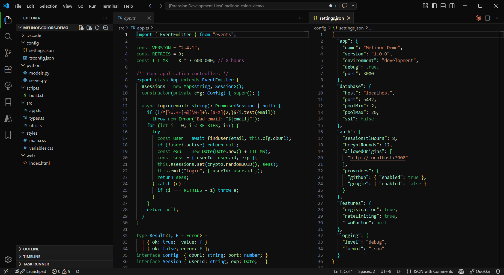
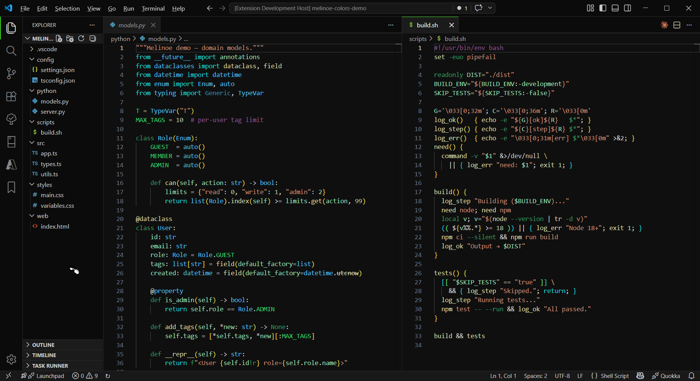
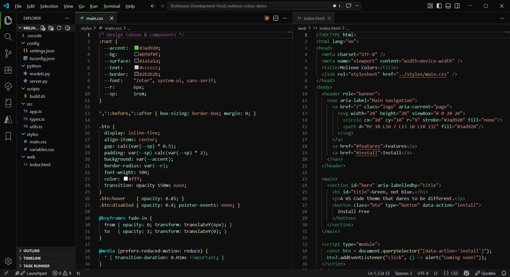

# Melinoe Colors

A dark VS Code color theme built around **green** as its primary accent color, in contrast to the blue-dominant palette of the default Dark+ family. Named after Melinoe, the chthonic goddess of ghosts in Greek mythology — fitting for a theme that lives in the dark.

---

## Screenshots

### TypeScript & JSON


### Python & Shell


### CSS & HTML


---

## Color Palette

| Role | Color | Preview |
|------|-------|---------|
| Background | `#0f0f0f` | Deep black |
| Keywords / Storage | `#3A9D60` | Forest green |
| Control flow | `#1ADADA` | Cyan |
| Functions | `#DCDCAA` | Warm yellow |
| Variables | `#9CE0BB` | Mint green |
| Constants | `#3AD970` | Bright lime |
| Strings | `#CE9178` | Warm orange |
| Comments | `#6A9955` | Muted green |
| Types (override) | `#4FC1FF` | Sky blue |
| Bracket pair 1 | `#EBDB4A` | Gold |
| Bracket pair 2 | `#1ADADA` | Cyan |
| Bracket pair 3 | `#6AEA80` | Lime green |

---

## Features

- **Green-first syntax** — keywords, control structures, storage types, and language constants all use green tones rather than blue
- **Cyan control flow** — `if`, `for`, `while`, `return` and C++ operator keywords stand out in bright cyan
- **Warm function names** — functions remain in familiar yellow for easy scanning
- **Mint variables** — local variables and attributes use a soft mint green that is easy on the eyes
- **Colorful bracket matching** — three distinct bracket-pair colors (gold, cyan, lime)
- **Full tokenization** — deep coverage of TypeScript, JavaScript, Python, CSS, HTML, Java, Go, C#, Groovy, PHP, Ruby, Rust, and more
- **Semantic highlighting** — enhanced token coloring via LSP semantic tokens
- **Near-black UI** — the editor chrome (sidebar, activity bar, panels, title bar) uses `#0b0b0b` for maximum contrast with code

---

## Installation

### From the Marketplace
Search for **Melinoe Colors** in the VS Code Extensions panel (`Ctrl+Shift+X`) and click Install.

### From VSIX
1. Download the `.vsix` file from the [Releases](../../releases) page
2. In VS Code, open the Command Palette (`Ctrl+Shift+P`)
3. Run **Extensions: Install from VSIX...**
4. Select the downloaded file

---

## Activation

1. Open the Command Palette (`Ctrl+Shift+P`)
2. Run **Preferences: Color Theme**
3. Select **Melinoe**

---

## Recommended Settings

These settings pair well with the theme:

```jsonc
{
  "editor.fontFamily": "'JetBrains Mono', 'Cascadia Code', 'Fira Code', monospace",
  "editor.fontLigatures": true,
  "editor.fontSize": 14,
  "editor.lineHeight": 1.6,
  "editor.bracketPairColorization.enabled": true,
  "editor.guides.bracketPairs": "active"
}
```
